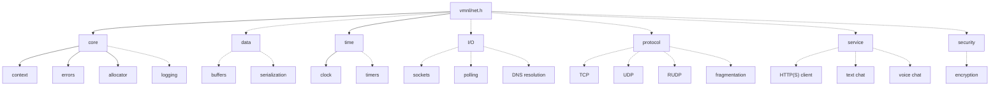

<div align="center">

# VMNL / Network

**Networking library in C**

TCP, UDP, reliable UDP (RUDP) and socket polling for games and real-time applications.

<br>


<br>

[](https://github.com/VMNL/vmnl-net/actions/workflows/ci.yml)


</div>

---

> [!WARNING]
> **Work in progress.** Anything can change without notice until `1.0.0`, use it at your own risk.

## Table of Contents

- [Overview](#overview)
- [Architecture](#architecture)
- [Installation](#installation)
- [Technical Documentation](#technical-documentation)
- [Roadmap](#roadmap)
- [References](#references)
- [Author](#author)
- [License](#license)

## Overview

`vmnl_net` is a cross-platform networking library written in C11.
It exposes a single non-blocking API over the native socket interfaces of Windows, macOS and Linux, and builds higher-level protocols and services on top of it.
It is developed as the networking module of the [VMNL](https://github.com/VMNL/vmnl) project and can be used on its own from any C or C++ application.

Feature highlights:

- TCP, UDP and RUDP, a reliable UDP protocol with connections and channels
- Native readiness polling: WSAPoll on Windows, kqueue on macOS and BSD, epoll on Linux
- IPv4 and IPv6
- No background threads: the application drives the library from its own loop, and functions are not thread-safe unless stated otherwise
- Explicit resource management: opaque handles, custom allocator per context and logging hooks, error codes reported through an optional last parameter
- An ABI easy to wrap from other languages: opaque handles and fixed-size integer types, the same on every platform

## Architecture



## Installation

### From GitHub releases

Each release ships with two prebuilt archives, static and shared libraries, for Windows x86_64, macOS arm64 and Linux x86_64.
Both contain the headers, the CMake package and the pkg-config file, and can be downloaded from the [releases page](https://github.com/VMNL/vmnl-net/releases).

Extract the archive with `tar`, which ships with Windows, macOS and Linux:

```sh
tar -xzf vmnl_net-v0.1.0-linux-x86_64-static.tar.gz
```

It creates a folder named after the archive, with `include/` and `lib/`, plus `bin/` for the Windows DLL.
Move it wherever you keep your dependencies, for example a `third_party` folder in your project: it is the prefix used in [Using the library](#using-the-library).

### From sources

You need CMake 3.28 or later (`cmake --version`) and one of these compilers, the first versions with C11 support:

- GCC 4.9 or later
- Clang 3.3 or later
- Apple Clang from Xcode 5.0 or later
- MSVC from Visual Studio 2019 version 16.8 or later, with the Windows SDK 10.0.20348.0 or later

> [!NOTE]
> Their support is theoretical: the CI only builds and tests with the compilers of the latest GitHub runners.

Then clone, build and install it:

```sh
git clone https://github.com/VMNL/vmnl-net.git
cd vmnl-net
cmake -B build
cmake --build build --config Release
cmake --install build --config Release --prefix <prefix>
```

The build can be tuned with these CMake options, which take `ON` or `OFF`:

| Option | Default | Effect |
| --- | --- | --- |
| `-DBUILD_SHARED_LIBS=` | `OFF` | Builds a shared library instead of a static one |
| `-DVMNL_NET_BUILD_TESTS=` | `ON` when built on its own | Builds the tests |
| `-DVMNL_NET_BUILD_DOCS=` | `OFF` | Generates the documentation with Doxygen into `build/docs/html` |
| `-DVMNL_NET_INSTALL=` | `ON` when built on its own | Generates the install rules |


### Using the library

The prefix is the extracted archive folder, or the `--prefix` given to `cmake --install`.

With CMake, pass it to `CMAKE_PREFIX_PATH` when configuring your project:

```sh
cmake -B build -DCMAKE_PREFIX_PATH=<prefix>
```

Then link the library in your `CMakeLists.txt`:

```cmake
find_package(vmnl_net 0.1 REQUIRED)
target_link_libraries(my_app PRIVATE vmnl::net)
```

Without CMake, pkg-config finds it as `vmnl-net`:

```sh
export PKG_CONFIG_PATH=<prefix>/lib/pkgconfig
cc main.c $(pkg-config --cflags --libs vmnl-net) -o main
```

With the shared library, the program must find it at run time: copy `bin/vmnl_net.dll` next to the executable on Windows, or add `-Wl,-rpath,<prefix>/lib` on macOS and Linux.

Include `<vmnl/net.h>` to get the whole API, which is described in the [API reference](https://vmnl.github.io/vmnl-net/topics.html).

### Development commands

These commands run from the root of the repository and need clang-format 22, Doxygen and gcovr installed.

Run the tests:

```sh
ctest --test-dir build --build-config Release
```

Generate the documentation with Doxygen into `build/docs/html`:

```sh
cmake -B build -DVMNL_NET_BUILD_DOCS=ON
cmake --build build --target docs
```

Check the formatting with clang-format 22, or fix it by replacing `--dry-run --Werror` with `-i`:

```sh
find src include tests \( -name '*.[ch]' -o -name '*.cpp' \) -exec clang-format --dry-run --Werror {} +
```

Run the tests with the sanitizers:

```sh
CFLAGS=-fsanitize=address,undefined CXXFLAGS=-fsanitize=address,undefined LDFLAGS=-fsanitize=address,undefined cmake -B build-sanitize -DCMAKE_BUILD_TYPE=Debug
cmake --build build-sanitize
ctest --test-dir build-sanitize --output-on-failure
```

Generate the coverage report with gcovr:

```sh
CFLAGS=--coverage CXXFLAGS=--coverage LDFLAGS=--coverage cmake -B build-coverage -DCMAKE_BUILD_TYPE=Debug
cmake --build build-coverage
ctest --test-dir build-coverage
gcovr --root . --filter src/ build-coverage
```

## Technical Documentation

The CI generates the API reference with Doxygen from the public headers and publishes it on [GitHub Pages](https://vmnl.github.io/vmnl-net/).

## Roadmap

Target dates are given by month and updated at each release.
A version is *Planned* until work starts, In progress while it is built, and **Released** once it is implemented, documented and tested on Windows, macOS and Linux.

| Version | Content | Target | Status |
| --- | --- | --- | --- |
| `0.1.0` | Build system, CI and packaging; core: library context, error codes and custom allocator | October 2026 | **Released** |
| `0.2.0` | Dynamic and circular byte buffers; monotonic clock and application-driven timers | November 2026 | In progress |
| `0.3.0` | Non-blocking socket wrapper over Winsock2 and BSD sockets, TCP and UDP sockets; logging hooks | December 2026 | *Planned* |
| `0.4.0` | Serialization: bit packing, fixed-size and variable-length integers, with bounds checking | January 2027 | *Planned* |
| `0.5.0` | Reliable UDP: connections, sequenced unreliable channels, ordered reliable channels with acknowledgments and retransmission, round-trip time and packet loss statistics | March 2027 | *Planned* |
| `0.6.0` | Polling for many sockets with WSAPoll, kqueue or epoll and DNS resolution to IPv4 and IPv6; the last `0.6.x` is the beta | April 2027 | *Planned* |
| `0.7.0` | Fragmentation of reliable messages larger than the path MTU | June 2027 | *Planned* |
| `0.8.0` | HTTP/1.1 client ([RFC 9112](https://www.rfc-editor.org/rfc/rfc9112)) and HTTPS | October 2027 | *Planned* |
| `0.9.0` | Text chat over reliable channels and voice chat over unreliable channels | November 2027 | *Planned* |
| `0.10.0` | Encrypted traffic between clients and servers | December 2027 | *Planned* |
| `1.0.0` | First stable release, with a stable C ABI | February 2028 | *Planned* |

## References

- [Gaffer On Games, game networking articles](https://gafferongames.com/categories/game-networking/) by Glenn Fiedler: my main source on UDP, which shaped the reliable UDP milestone (connections, sequencing, acknowledgments, packet loss and round-trip time).
- [Quake 3 Source Code Review: Network Model](https://fabiensanglard.net/quake3/network.php) by Fabien Sanglard and the [Quake III Arena network channel](https://github.com/id-Software/Quake-III-Arena/blob/master/code/qcommon/net_chan.c): how a shipped game builds reliable delivery over UDP, with sequencing, delta compression and fragmentation.
- [netcode](https://github.com/mas-bandwidth/netcode): a reference design of secure client/server connections over UDP, for the connection and encryption milestones.
- [Beej's Guide to Network Programming](https://beej.us/guide/bgnet/): my starting point for DNS resolution and for polling many sockets.
- [WSAPoll](https://learn.microsoft.com/en-us/windows/win32/api/winsock2/nf-winsock2-wsapoll), [kqueue(2)](https://man.freebsd.org/cgi/man.cgi?query=kqueue) and [epoll(7)](https://man7.org/linux/man-pages/man7/epoll.7.html): the reference for the exact behavior of each polling API.
- [RFC 768](https://www.rfc-editor.org/rfc/rfc768) (UDP), [RFC 9293](https://www.rfc-editor.org/rfc/rfc9293) (TCP) and [RFC 9112](https://www.rfc-editor.org/rfc/rfc9112) (HTTP/1.1): the specifications the UDP, TCP and HTTP layers follow.

## Author

[Laszlo Serdet](https://github.com/lszsrd), networking lead of VMNL.

## License

Released under the [MIT License](https://github.com/VMNL/vmnl-net/blob/main/LICENSE).
